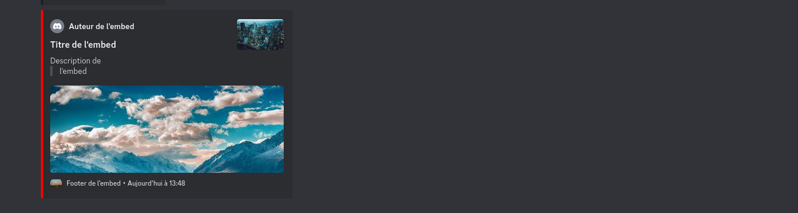

# 🪟 C'est quoi un embed ?

Un embed est un type de message discord ( un **composant** plus precisement). Tu peux le personnaliser à ta guise et les possibilités sont infinies !

Voici à quoi peut ressembler un embed :&#x20;

<figure><figcaption>
Exemple de ce qu'est un embed
</figcaption></figure>

Un embed peut etre composé de plusieurs éléments :&#x20;

> Couleur: couleur que aura l'embed
>
> Titre : titre de l'embed
>
> Description : description de l'embed
>
> Auteur : auteur de l'embed
>
> Vignette : thumbnail de l'embed (sur l'image en haut à droite)
>
> Image : Image de l'embed
>
> Footer : footer de l'embed
>
> Vignette Date : vignette de date de création de l'embed

Le créateur de l'embed est encore en beta, donc un peu capricieux parfois mais totalement fonctionnelle !

N'hesite pas à me signaler les bugs que tu as pu recontrer sur celui ci.

