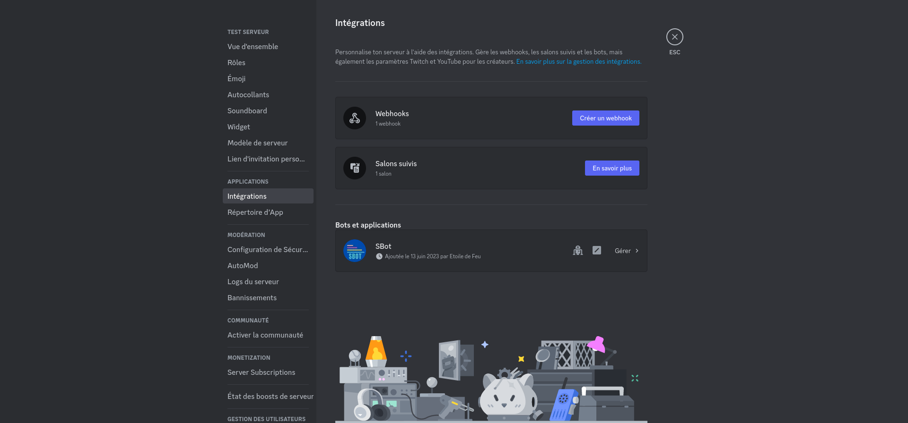
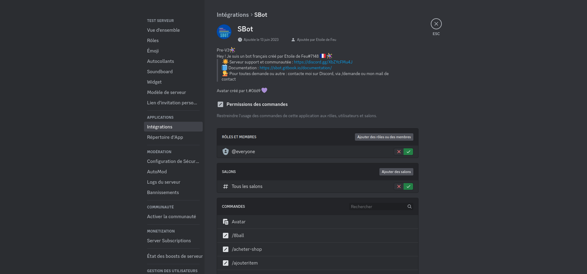
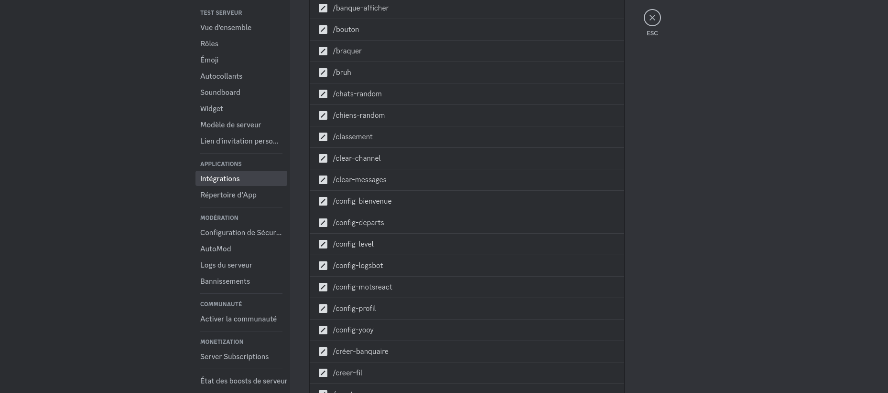
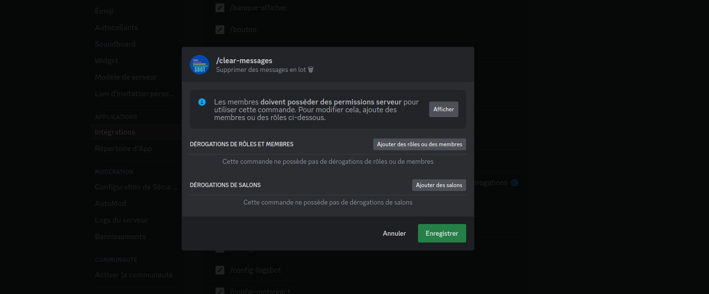
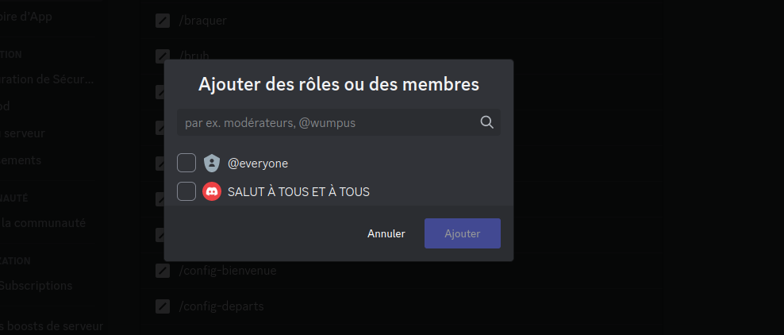
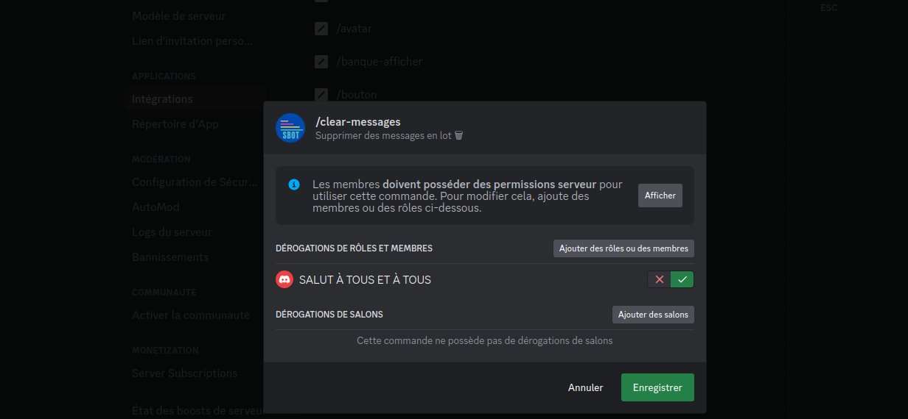
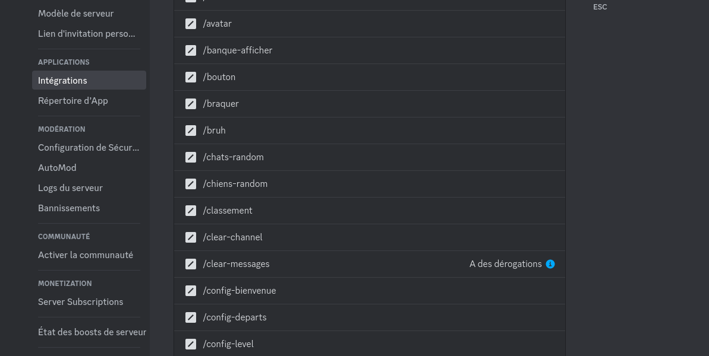

# 🔘 Permissions slashs commandes

Par défaut, Sbot configure automatiquement les permissions des slashs commandes (par exemple tout le monde a accès à /8ball mais seul les personnes ayant la permission gérer les messages ou admin ont accès à /clear-messages). Néanmoins tu peux modifier cela très facilement.

## Il  faut être sur ordinateur ou navigateur

Va dans les paramètres du serveur, puis \*intégrations\*. Tu devrais voir un truc comme ça :&#x20;

<figure><figcaption>
Menu des interactions Discord
</figcaption></figure>

Sélectionne Sbot, tu arriveras sur ce menu :&#x20;

<figure><figcaption></figcaption></figure>

Dans ce menu, tu retrouveras les commandes slashs de Sbot:

Outre le fait que tu peux limiter les channels où l'on peut utiliser les commandes, tu peux modifier qui peut accéder une commande.

Clique sur la commande que tu veux modifier (si tu veux modifier toutes les commandes en même temps clique sur "rôles et membres" au dessus du label "/ Permission des commandes"

<figure><figcaption></figcaption></figure>

<figure><figcaption>
Tu arriveras sur cette fenêtre
</figcaption></figure>

Sur cette fenêtre, tu peux ajouter des rôles ou des membres autorisés à accéder à la commande, ajouter des salons où la commande peu être exécutée, et afficher les permissions de la commande actuelle.

Dans notre cas, clique sur le bouton "Ajouter des rôles ou des membres".

<figure><figcaption></figcaption></figure>

Ici tu peux sélectionner tous les rôles ou membres qui auront désormais accès à la commande (remarque: cocher @everyone autorisera tous les membres à accéder à la commande). Puis clique sur Ajouter. Si je veux que "SALUT À TOUS ET À TOUTES" seul ait accès à la commande par exemple, je selectionne.

<figure><figcaption></figcaption></figure>

Ensuite, clique sur enregistrer

<figure><figcaption></figcaption></figure>

Et voilà ! Désormais seuls les rôles et les utilisateurs que tu as sélectionné auront accès à la commande. Tu verras le label "A des dérogations", indiquant que l'opération a réussi.

## Il convient tout de même de noter :&#x20;

> \*\*Les personnes ayant la permissions administrateurs auront toujours la possibilité d'accéder à toutes les commandes\*\*
>
> **Fais attention : par exemple ne donne pas l'accès de /clear-messages à tous le monde, pour éviter les mauvaises utilisations !**

## Astuce

> Pour aller plus rapidement, tu peux faire clique droit sur la photo de profil de Sbot puis sur "gérer l'intégration" afin de directement arriver sur le menu des interactions de SBot !
